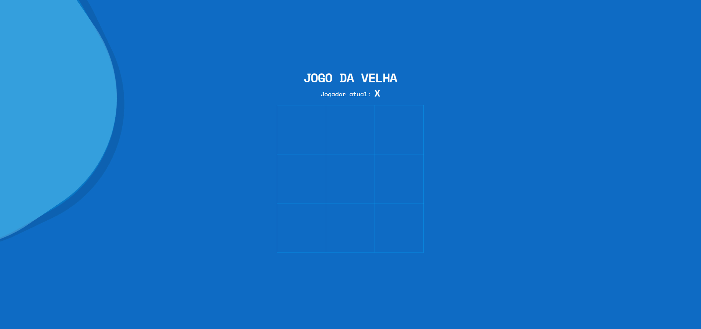

# Table Interation
<h1 align="center">
    
</h1>

# Descrião
Projeto realizado com intuito de praticar e consolidar conhecimentos básicos em Angular. O trabalho consiste em um jogo chamado Jogo da Velha, para realização foram utilizados apenas o framework Angular, utilizando conceitos básicos como interpolação, property-bind e diretivas condicionais como ngIf.

# Construído com
 - **Angular - Angular** é uma plataforma de aplicações web de código-fonte aberto e front-end baseado em TypeScript liderado pela Equipe Angular do Google e por uma comunidade de indivíduos e corporações.

## Status do Projeto
**Concluído:** O projeto se encontra finalizado.

## Autor
- **Desenvolvimento: Leonardo Borges** - Responsável pelo desenvolvimento da aplicação;
